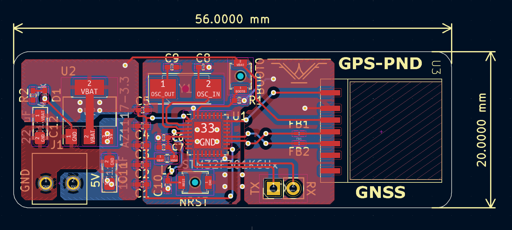

# GPS PND Project

This repository contains the KiCad design files and documentation for the GPS PND (Portable Navigation Device) project. The design includes a power supply circuit, STM32F301K6 microcontroller, and the MS38SN4 GNSS module, aimed at providing GPS functionality for various IoT and navigation applications.

## Features

### Power Supply: AZ1117-3.3
- Stable 3.3V output for powering the MCU and GNSS module.
- Low dropout regulator with thermal shutdown and overcurrent protection.
- [More Information - AZ1117-3.3](https://www.google.com/url?sa=t&source=web&rct=j&opi=89978449&url=https://www.diodes.com/assets/Datasheets/products_inactive_data/AZ1117.pdf&ved=2ahUKEwjyg4W8j6yJAxUHLrkGHUjTN9YQFnoECAwQAQ&usg=AOvVaw0PLg3CQl6F88jSyHaR0euA)

### Microcontroller: STM32F301K6
- ARM Cortex-M4 operating at 72 MHz with FPU for enhanced processing.
- 32 KB Flash memory and 16 KB SRAM.
- Connected to various peripherals such as USART, which is used both for communication and boot processes, and GPIO, which is used for control and to handle the PPS interrupt signal from the GNSS module.
- [More Information - STM32F301K6](https://www.st.com/en/microcontrollers-microprocessors/stm32f301k6.html)

### GNSS Module: MS38SN4
- Multi-constellation GNSS receiver: GPS, Beidou, Glonass, Galileo.
- Ultra-low power consumption for battery-operated devices.
- Integrated PPS (Pulse Per Second) output for precise synchronization.
- [More Information - MS38SN4](https://en.minewsemi.com/gnss-module/ms38sn4)

## Requirements

### Hardware:
- AZ1117-3.3V Low Dropout Regulator
- STM32F301K6U6 ARM Cortex-M4 Microcontroller
- MS38SN4 GNSS Module
- 20mmx56mm PCB board
- 

  
### Software:
- KiCad for PCB design
- STM32CubeIDE or Keil for programming the microcontroller
- GNSS data parsing libraries (optional, depending on application) [More Information - MS38SN4](https://en.minewsemi.com/gnss-module/ms38sn4)

